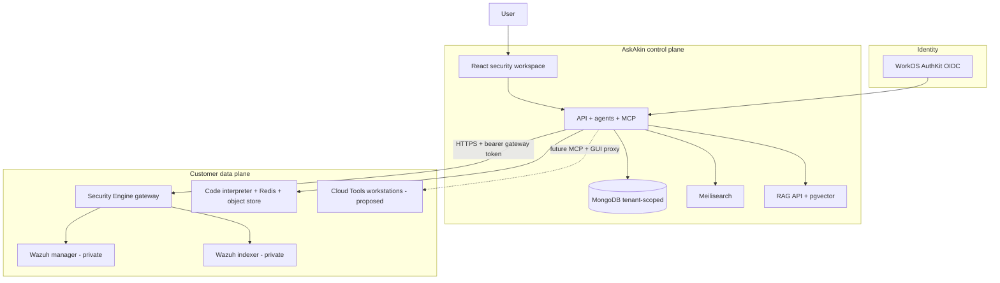

# AkinSec / AskAkin

**AkinSec** is a cybersecurity company. **AskAkin** is the product: a
multi-tenant security workspace with multi-provider AI chat, agents,
skills, and a live SIEM surface.

This repository is public architecture and product documentation. The
AskAkin application source is private. The docs describe structure and
limits. They omit internals that would map a live attack surface.

| | |
|---|---|
| Product | [https://app.akinsec.com](https://app.akinsec.com) |
| Company | [https://akinsec.com](https://akinsec.com) |
| Application source | Private. This repo is not a clone of AskAkin. |
| Docs license | [CC BY 4.0](LICENSE) (documentation only) |

[](docs/README.md)
[](LICENSE)
[](docs/00-what-this-repo-is.md)
[](docs/product/security-engine.md)

---

## Authorized use

AkinSec products are for **defending and authorized testing of systems
the customer owns or has written permission to test**. Hosted web-testing,
packet-analysis, and reverse-engineering tools will be **scope-bound**.
Using the platform to attack third parties is prohibited and technically
constrained (egress allowlists, session audit, kill switch).

---

## What is implemented vs designed

Security Engine provisioning, the AskAkin workspace, MCP SIEM tools,
OIDC tenancy, and the org-scoped code interpreter are **implemented in
the private product**. Cloud-hosted Burp/Wireshark/Ghidra/IDA
workstations are **designed, not shipped**. This repository exists so
the design can be reviewed in public while the application source stays
private.

| Capability | Status |
|---|---|
| Multi-provider AI chat, agents, skills, MCP, RAG, file upload | **Shipped** |
| Security workspace tabs (Chat, Activity, Alerts, Devices, Threats, Ops, Cloud, Config) | **Shipped** |
| Per-user Security Engine (Wazuh manager + indexer + authenticated gateway) | **Shipped** |
| AkinSec MCP SIEM tools (read + audited single-target writes) | **Shipped** |
| WorkOS/OIDC, org → tenant, Mongo tenant isolation | **Shipped** |
| Org-scoped code interpreter (nsjail; host capability requirements) | **Shipped**, isolation depends on host |
| Public agent enrollment (classic 1514/1515 edge) | **Partial** — v1 limitation |
| Org-shared SIEM + seat RBAC | **Proposed** (v1 is per-user stacks) |
| Payment processor / live subscriptions | **Not shipped** (entitlement hook only) |
| Wazuh Dashboard as UI | **Not shipped** — AskAkin is the UI |
| Cloud Tools (ZAP/Wireshark/Ghidra/Burp/IDA labs) | **Proposed** — [RFC](docs/cloud-tools/README.md) |

Read the labels. Do not treat the RFC as a live SKU.

---

## Architecture (control plane vs data plane)



**Core decision (shipped):** AskAkin does **not** call the Wazuh manager
or indexer URLs directly in production. The **gateway is the only public
SIEM ingress**. Manager and indexer stay on a private network. Gateway
tokens are encrypted at rest on the control plane; stack passwords stay
on the cloud project. Tokens must not appear in chat.

Details: [system context](docs/architecture/system-context.md) ·
[gateway](docs/architecture/gateway.md) ·
[ADR-0002](docs/adr/0002-gateway-only-ingress.md)

---

## Security Engine (one screenful)

When a user enables Security Engine, the platform provisions an
**isolated cloud project for that user**: Wazuh manager, Wazuh indexer
(OpenSearch), and a **public gateway**. That is a **4.12-era managed
Wazuh stack**, not a Wazuh fork.

```text
Analyst  →  AskAkin UI / Agent
              │  JWT session (OIDC-backed)
              ▼
         AskAkin API
              │  loads an encrypted gateway token from the control plane
              │  (tokens must not appear in chat)
              ▼
         Gateway (only public hostname)
              │  Bearer token
              ├── allowlisted manager API  →  Wazuh manager (private DNS)
              └── allowlisted indexer search →  Wazuh indexer (private DNS)
```

**v1 limits:** stacks are **per user**, not org-shared. Agent
enrollment ports are **not** publicly exposed the way a classic on-prem
manager would be. Billing can **enforce** entitlement; payments are
**not live**.

Full write-up: [docs/product/security-engine.md](docs/product/security-engine.md)

---

## Workspace tabs (shipped)

| Tab | Analyst surface |
|-----|-----------------|
| Chat | Multi-model chat; floating chat over other tabs |
| Activity | Agent health, 24h severity, module cards |
| Alerts | Discover: query, filters, histogram, inspect, export, saved searches |
| Devices | Agent inventory, status, OS, CSV export |
| Threats | Vulnerabilities, SCA, MITRE-oriented views |
| Ops | Hygiene, PCI DSS, GDPR, HIPAA, NIST, TSC posture rollups |
| Cloud | Docker, AWS, GCP, GitHub, Microsoft 365, Graph (indexer-backed when configured) |
| Config | Engine status, provision/stop, connection health |

Onboarding: **choice → company/org details → confirm → provisioning poll → done**.

[Workspace](docs/product/workspace.md) · [Agents & MCP](docs/product/agents-mcp-skills.md)

---

## MCP + agents (shipped)

Analysts talk to a seeded **AkinSec Security Analyst** agent. The agent
calls **live SIEM tools** over MCP. Tools never invent agents, alerts,
or CVEs. If the engine is not provisioned, the agent sends the user to
onboarding. Writes are **audited** and **single-target** (restart one
agent; assign one agent to an existing group). Bulk destructive SIEM
actions are out of v1 scope.

The AkinSec MCP server exposes status, inventory, alert search, threats,
saved searches, and two audited single-target writes. Full catalog:
[agents-mcp-skills.md](docs/product/agents-mcp-skills.md).

Same operations layer; **REST for the first-party UI**, **MCP for the model**.
[ADR-0008](docs/adr/0008-mcp-and-rest-facades.md)

---

## Identity and tenancy (shipped)

Production login is **OIDC (WorkOS AuthKit)**. An organization claim
maps to `tenantId`. A Mongo plugin injects tenant scope into queries
and **rejects cross-tenant writes**. Code interpreter stacks are
**org-scoped**. Security Engine v1 is **per user**, not org-shared.

[Identity](docs/product/identity-tenancy.md) ·
[Data isolation](docs/architecture/data-isolation.md) ·
[ADR-0006](docs/adr/0006-tenant-isolation-data-layer.md)

---

## Cloud Tools (proposed)

The design reuses the same isolation, gateway, and MCP pattern as
Security Engine: isolated projects, authenticated gateway/broker, MCP
adapters, encrypted artifacts, human-in-the-loop for dangerous actions.
The provisioner, gateway, and MCP SIEM tools are implemented; hosted
labs are not.

**Classes (comparables, not shipped SKUs):**

- Web testing — OWASP ZAP default; Burp Suite **BYOL** if an ISV path exists
- Packet analysis — Wireshark / tshark on **customer-owned** captures
- Reverse engineering — Ghidra default; IDA Pro **BYOL only if Hex-Rays terms allow hosted use**

Start here: **[docs/cloud-tools/README.md](docs/cloud-tools/README.md)**

---

## Documentation map

| Section | What you will find |
|---------|-------------------|
| [docs/README.md](docs/README.md) | Full index |
| [Product](docs/product/askakin.md) | AskAkin, engine, workspace, MCP, identity, interpreter, billing |
| [Architecture](docs/architecture/system-context.md) | Context, containers, provisioning, gateway, secrets, [one plane vs five consoles](docs/architecture/one-operations-plane.md), upstream |
| [ADRs](docs/adr/README.md) | Eighteen decisions (accepted and proposed) |
| [Security](docs/security/threat-model.md) | Threat model, data handling, HITL, authorized use |
| [Cloud Tools RFC](docs/cloud-tools/README.md) | Catalog, isolation, MCP, licensing, phases, SKUs (this **is** the roadmap) |
| [Essays](docs/essays/README.md) | Long-form engineering notes |
| [Operations](docs/operations/reliability.md) | Provision resume/cancel/health, cost estimates |
| [FAQ](docs/faq.md) · [Glossary](docs/glossary.md) | Short answers and terms |

---

## Upstream

AskAkin’s conversational UI is **LibreChat-lineage**. AkinSec is
**not** the LibreChat project and does **not** open-source the product.
Detection is a **managed Wazuh** stack. Identity is **WorkOS AuthKit**.
See [NOTICE.md](NOTICE.md) and
[upstream notes](docs/architecture/upstream-librechat.md).

Related public work (not the app):
[LibreChat-akinsec](https://github.com/dfalt0/LibreChat-akinsec),
[wazuh-n8n](https://github.com/dfalt0/wazuh-n8n).

---

## Why public docs + private code

Detection content, tenant isolation internals, gateway allowlists, and
provisioner credentials are **security-sensitive**. Public architecture
can still describe structure and limits without publishing a map of
every internal path.

### What this repo is not

- Not a working SIEM or a clone-and-run kit
- Not a Burp/Ghidra deployment bundle
- Not a pentest blog
- Not an API reference that matches private routes 1:1
- Not a SOC 2 / ISO attestation (the design can *support* future audits)

---

## Contact

- App: [https://app.akinsec.com](https://app.akinsec.com)
- Company: [https://akinsec.com](https://akinsec.com)
- GitHub: [dfalt0](https://github.com/dfalt0)
- Site: [https://dfalt0.com](https://dfalt0.com)

Vulnerability reports: [SECURITY.md](SECURITY.md)
