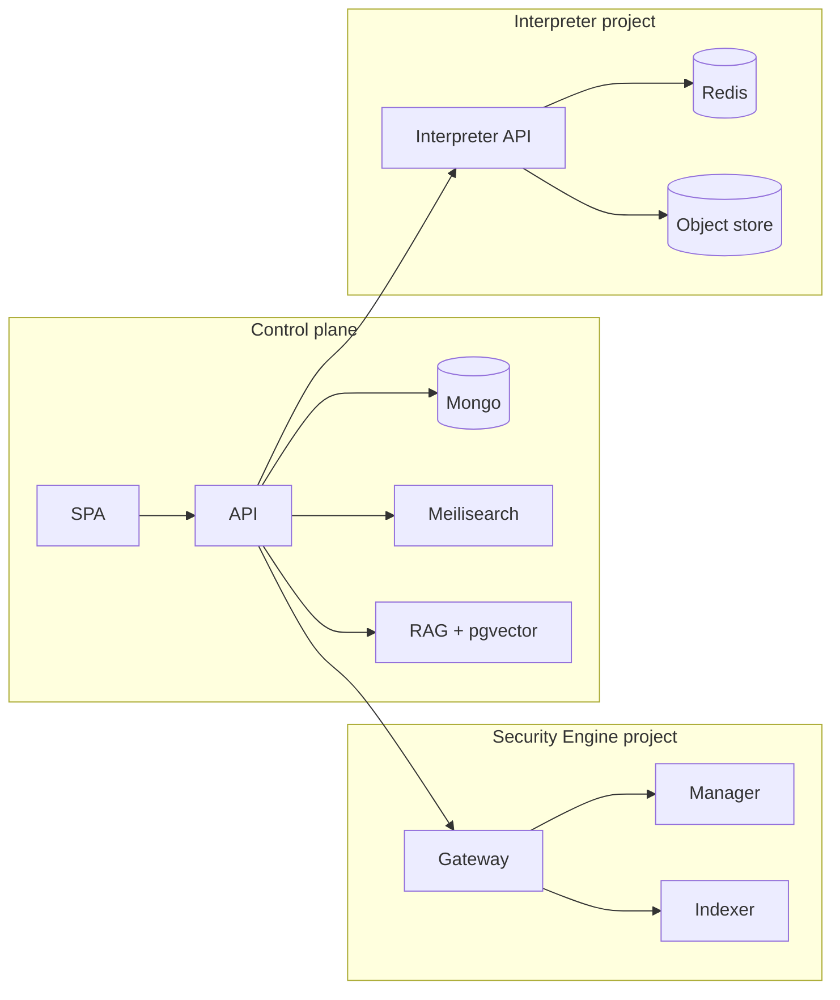

# Containers

**Status: Shipped** for the control plane and two classes of cloud
project. Helm for the chat API is **lineage**, not “SIEM runs on k8s
today.”

## AskAkin control plane

| Container / process | Role |
|---------------------|------|
| React SPA | Security workspace |
| API (legacy Express wrapper + TypeScript package) | Sessions, agents, MCP, provisioners, SIEM operations |
| MongoDB | Tenant-scoped documents |
| Meilisearch | Conversation / message search |
| RAG API + pgvector | Embeddings |
| Optional Redis | Jobs, MCP registry cache, interpreter coordination |
| Optional OTEL / Langfuse-style fanout | Multi-tenant LLM traces |

Object storage holds files, interpreter blobs, and (proposed) lab
artifacts. Strategies may include S3-compatible, Azure, or similar
**config-driven** backends. This is not a vendor lock-in claim.

## Per-user Security Engine (shipped)

Three containers:

1. **Wazuh indexer** (OpenSearch) — private
2. **Wazuh manager** — private
3. **Gateway** — only public hostname

Dependency order: indexer boot window first (JVM + security plugin),
then manager, then gateway. Health is “manager and indexer respond,”
not “alerts already exist.”

## Per-org code interpreter (shipped)

Three containers: interpreter API (public HTTPS), Redis (private),
object storage (private). See [code-interpreter.md](../product/code-interpreter.md).

## What is not a container you can pull to run AskAkin

The application source stays private. Public images are for the
**provisioned SIEM stack**. [ADR-0011](../adr/0011-public-images-private-source.md).

## Kubernetes

A Helm chart lineage exists for the **chat API**. Production Security
Engine provisioning is **per-project PaaS**. A Kubernetes-native
provisioner with the **same gateway pattern** is **Proposed**
([cloud-tools/isolation.md](../cloud-tools/isolation.md)).

Entity names on the control plane (not schemas): users (with Security
Engine subdocument), tenants, conversations, messages, agents, skills,
ACL, files, API keys (encrypted), saved SIEM searches, code-interpreter
tenant records, audit logs, balances/transactions (lineage).
