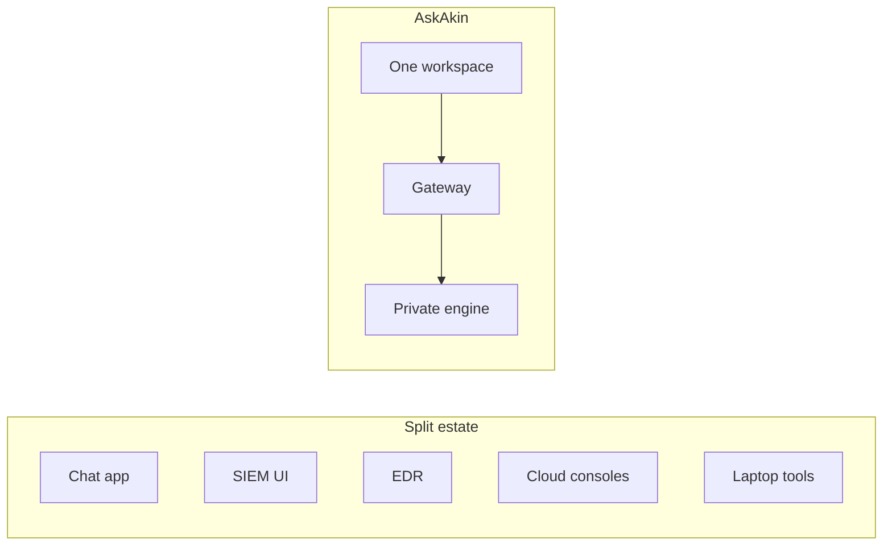

# One operations plane vs five consoles

**Status: Shipped** for AskAkin chrome (eight tabs, one login).
**Partial** for Ops/Cloud depth. **Proposed** for Labs.

This is the comparison the architecture is meant to win — not a
certified GRC claim and not a promise that every detector is unique.

Legacy programs scatter **detection, cases, endpoints, cloud, and
chat** across vendors. AskAkin’s bet is one authenticated workspace
whose SIEM data path is the **gateway**, not five admin URLs.

| Job | Typical split-console estate | AskAkin |
|-----|------------------------------|---------|
| Identity | IdP + SIEM local users + chat SaaS | **Shipped:** WorkOS OIDC → tenant |
| Chat / copilot | Consumer or separate “AI SOC” tab | **Shipped:** Chat + floating chat over other tabs |
| Alerts / discover | Vendor SIEM UI | **Shipped:** Alerts tab via gateway → indexer |
| Devices | Same or another console | **Shipped:** Devices tab |
| Threats / vulns / MITRE | Extra module or extra product | **Shipped** views when data exists |
| Compliance posters | GRC tool disconnected from telemetry | **Partial:** SCA rollups, not a certification |
| Cloud connectors | Each CSP console + SIEM | **Partial:** cards when integrations exist |
| Analyst labs | Laptop Burp/Wireshark/Ghidra | **Proposed:** Cloud Tools, same tenant/broker pattern |
| Vendor dashboard | Wazuh Dashboard / Kibana-like | **Not shipped on purpose** — [ADR-0017](../adr/0017-no-wazuh-dashboard.md) |

SOAR-style runbooks and MDR packaging on marketing pages describe
**intent**. v1 MCP writes are still single-target and audited
([ADR-0009](../adr/0009-audited-single-target-writes.md)). Do not read
this table as “full SOAR product shipped.”

Related: [workspace.md](../product/workspace.md) ·
[gateway.md](gateway.md) ·
[cloud-tools/README.md](../cloud-tools/README.md)
