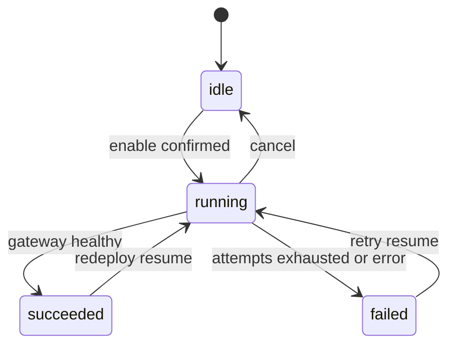
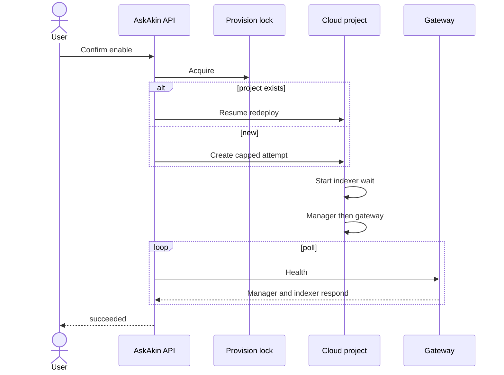

# Provisioning

**Status: Shipped** for Security Engine and org interpreter.
Cloud Tools provisioner is **Proposed**.

Provisioning is a **product**, not a script an intern runs once.
Essay: [Provisioning as a product](../essays/02-provisioning-as-a-product.md).

## State machine (shipped)

States: `idle` → `running` → `succeeded` | `failed`. Cancel returns
toward `idle`.

## Public-safe properties (shipped)

| Property | Why |
|----------|-----|
| Atomic lock | Two “Enable SIEM” clicks must not create two cloud projects |
| Resume | Existing project id → redeploy, never duplicate |
| Stale lock recovery | `running` can be re-acquired after timeout |
| Attempt cap | Fresh creates are rate-limited against cost abuse |
| Deleted-project detection | Stale IDs cleared before a new create |
| Dependency order | Indexer first + boot window; manager; gateway |
| Unique hostname | Company slug + disambiguator, not a shared global name |
| Health semantics | Ready when manager and indexer respond; empty indices OK |
| Cancel | User can stop in-flight work |
| Entitlement hook | Billing can gate later without a rewrite |

Health waits can be **many minutes**. A synchronous HTTP handler that
times out at 30 seconds is the wrong abstraction.
[ADR-0007](../adr/0007-async-provision-resume.md).

## Sequence (conceptual)

Human confirmation is required before create ([ADR-0010](../adr/0010-human-confirmation-before-provision.md)).

## Cloud Tools (**Proposed**)

Same muscle: entitlement, lock/resume, isolated environment, broker
hostname, health wait, cancel, destroy-on-TTL. SKU sizing differs
(analysis VMs need RAM the way the indexer taught the platform).
[sku-sizing.md](../cloud-tools/sku-sizing.md).
