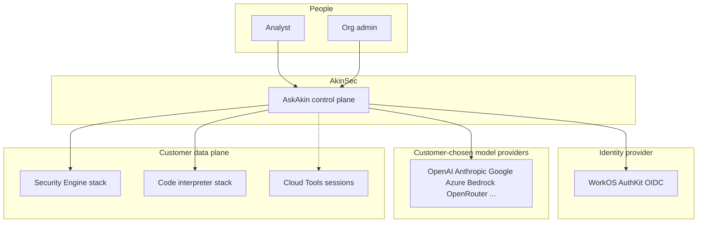

# System context

**Status: Shipped** for AskAkin + Security Engine + interpreter.
Cloud Tools box is **Proposed**.

C4 **context**: people and systems that touch AskAkin. No internal file
paths.

## Actors

| Actor | Intent |
|-------|--------|
| Analyst | Investigate alerts, chat with the Security Analyst agent, export evidence |
| Org admin | Provision interpreter; later: shared SIEM, Cloud Tools SKUs, scope documents |
| AkinSec operator | Platform health, image publish, selective upstream sync — not tenant data browsing as a product feature |

## External systems (shipped)

| System | Trust note |
|--------|------------|
| WorkOS AuthKit | Production identity. Org claim → tenant. |
| Model providers | BYOK. AkinSec does not require a single hosted model. |
| Cloud PaaS | Per-user SIEM projects and org interpreter projects today. |
| Docker Hub `akinsec` namespace | Public **stack** images for provisioned SIEM; not the app source. |

## Trust boundary (the one that matters)

The control plane holds **encrypted metadata** (including gateway
tokens). The data plane holds **telemetry and vendor runtime secrets**.
AskAkin reaches SIEM **only** through the gateway. Models never receive
gateway tokens.

Proposed Cloud Tools sessions sit on the **data plane** side of that
line: isolated projects, broker, egress allowlist. Dotted arrow in the
diagram means **not shipped**.

Next: [containers.md](containers.md).
