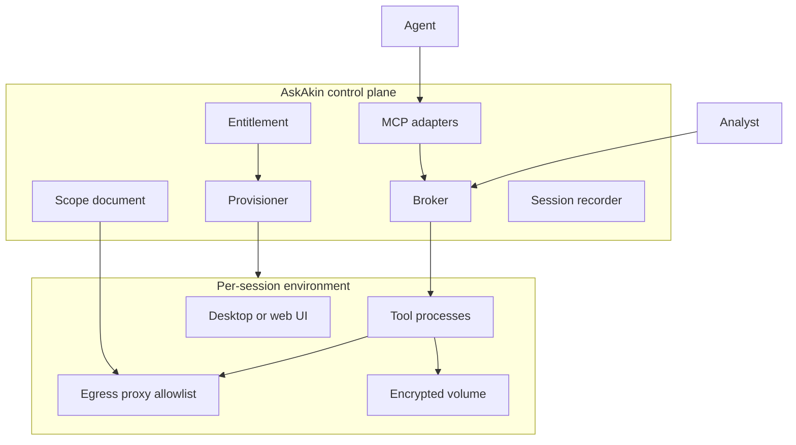

# Cloud Tools RFC

**Status: Proposed.** Security Engine provisioning, AskAkin workspace,
MCP SIEM tools, OIDC tenancy, and org-scoped code interpreters are
**implemented**. Hosted Burp/Wireshark/Ghidra/IDA workstations are
**designed, not shipped**.

This RFC is the public design. It exists because AkinSec
already provisions isolated security infrastructure and
lets agents call **real tools**. Labs apply that isolation,
gateway, and MCP pattern to analyst workstations — not a
chatbot that draws a picture of Wireshark.

Shipped pattern: [Security Engine](../product/security-engine.md).
Constraint ADRs: [0013](../adr/0013-cloud-tools-same-pattern.md),
[0014](../adr/0014-authorized-scope-binding.md),
[0015](../adr/0015-byol-oss-first.md),
[0016](../adr/0016-ai-copilot-hitl.md).

## Problem

Security teams already pay for Burp Suite, Wireshark, Ghidra, sometimes
IDA. Those tools live on laptops, jump boxes, or ad-hoc VMs. They are
hard to:

- provision for a new analyst in minutes
- isolate per engagement
- audit
- connect to an AI copilot that can **drive the real tool**, not a toy wrapper
- shut down when the engagement ends

AskAkin already provisions **heavy, stateful** SIEM stacks **per user**
and already connects **AI agents to live tools via MCP**. Cloud Tools
is the same platform applied to **interactive analyst workstations**.

## Product principles

1. **Customer-owned scope only.** Every session binds to an asset
   inventory: CIDRs, domains, binaries the customer uploaded, packet
   captures they uploaded, staging URLs they own. Default deny.
2. **Fully functional tools**, not screenshots. If we host Wireshark, it
   analyzes real pcaps. If we host Ghidra, it decompiles customer-supplied
   binaries. If we host a web tester, it talks to **in-scope** HTTP(S)
   targets.
3. **AI control + human control.** MCP for scripted/copilot operations;
   pixel-stream or HTML UI for the human. Dangerous actions require
   explicit approval in AskAkin.
4. **Isolation.** One workstation project (or namespace) per tenant
   session. No shared GPU/VM that can leak files across customers.
5. **License honesty.** OSS tools we can ship. Commercial tools: BYOL
   or ISV partnership. Never pirate IDA/Burp.
6. **Audit.** Session recording metadata, tool command logs, MCP call
   logs, egress logs. Exportable for IR.
7. **Cost gates.** Sleep on idle, disk quotas, GPU as add-on.

## Authorized use

AkinSec products are for **defending and authorized testing of systems
the customer owns or has written permission to test**. Hosted
web-testing, packet-analysis, and reverse-engineering tools will be
**scope-bound**. Using the platform to attack third parties is
prohibited and technically constrained (egress allowlists, session
audit, kill switch).

## Architecture — reuse Security Engine

```text
AskAkin control plane
  - entitlement: which tool SKUs the org bought
  - scope document: domains, CIDRs, artifact IDs
  - provisioner: create isolated environment
  - gateway / broker: authenticates analyst + agent
  - MCP adapter per tool: typed tools, timeouts, HITL flags
  - session recorder: start/stop, artifact promotion

Per-session environment (cloud project, k8s namespace, or Firecracker microVM)
  - desktop or web UI (Kasm, Apache Guacamole, or native web UIs)
  - tool processes
  - sidecar egress proxy (allowlist)
  - volume for workspace (encrypted)
  - no lateral routing to other tenants or to AkinSec control plane DB
```



**Broker vs raw desktop:** Prefer a **tool broker** (HTTP + MCP) for AI.
Prefer **remote desktop** for humans. Same session id.

**GPU:** optional for decompilers / ML-assisted RE later. Default CPU SKUs.

### Data path for a binary

```text
Analyst uploads firmware.bin (tenant-scoped object store)
  → Cloud Tool session mounts it read-only
  → Ghidra import (headless) → analysis artifacts
  → MCP: list_functions, decompile(function_id), search_strings
  → Agent writes a report in AskAkin chat
  → Human exports report; session can be destroyed
```

### Data path for web testing

```text
Org admin registers https://staging.customer.example as in-scope
  → Broker injects that allowlist into ZAP/Burp outbound proxy
  → Attempts to http://not-in-scope.example are blocked at egress
  → Agent may request "passive scan"; "active scan" requires HITL click
```

## What the copilot is allowed to do

- **Wireshark/tshark:** “Summarize protocols in this pcap”; “find DNS
  names”; “extract HTTP objects to the artifact store.”
- **Ghidra:** “List imported APIs”; “decompile `main`”; “find strings
  that look like URLs”; “diff two firmware versions.”
- **ZAP:** “Show in-scope sitemap”; “run passive scan”; “export alerts
  of high confidence.”
- **Burp (BYOL):** human-primary; AI summarizes proxy history the
  customer already captured.

AkinSec will **not** build an AI that autonomously exploits third-party
systems. Authorized offensive testing, if ever offered, is a **separate
engagement mode** with contracts, scope, and humans in the loop.

## RFC index

| Document | Contents |
|----------|----------|
| [catalog.md](catalog.md) | Tool catalog, license class, waves |
| [isolation.md](isolation.md) | PaaS vs k8s vs microVM vs customer VPC |
| [mcp-design.md](mcp-design.md) | Typed verbs, HITL flags, injection |
| [licensing.md](licensing.md) | GPL, Apache, Burp EULA, Hex-Rays |
| [ux.md](ux.md) | Labs tab, split view, approval cards |
| [phases.md](phases.md) | Phase 0–6, no calendar promises |
| [sku-sizing.md](sku-sizing.md) | Design estimates; JVM memory lesson |
| [comparison-burp-zap.md](comparison-burp-zap.md) | Why ZAP is default |
| [comparison-ghidra-ida.md](comparison-ghidra-ida.md) | Why Ghidra is default |

Essay: [Hosting Wireshark and Ghidra is an isolation problem](../essays/07-isolation-not-a-wrapper.md).
