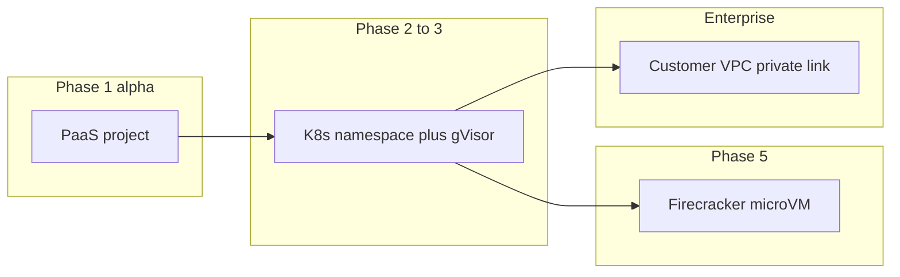

# Isolation options

**Status: Proposed** for labs. Security Engine today is **PaaS per
project** — that is the alpha candidate, not a secret k8s already in
prod.

[ADR-0013](../adr/0013-cloud-tools-same-pattern.md) requires isolated
environments, a broker, and no lateral path to the control-plane DB.

## Comparison

| Backend | Pros | Cons | When |
|---------|------|------|------|
| Same PaaS as Security Engine (Railway-like) | Reuse provisioner, billing hook, hostnames | Privileged containers, noisy neighbors, GPU weak | **Early alpha** (ZAP, tshark, Ghidra headless) |
| Kubernetes + NetworkPolicy + gVisor | Stronger multi-tenant, GPU operators | Ops cost | **Beta** |
| Firecracker / Cloud Hypervisor microVMs | Best isolation for malware RE | Longer boot, image factory | **Malware and untrusted samples** |
| Customer VPC (private link) | Data never in AkinSec cloud | Sales/engineering heavy | **Enterprise** |

**Recommend:** alpha on existing provisioner + gateway pattern; beta on
k8s; malware on microVMs.

## Why not the code interpreter

The org interpreter uses **nsjail inside an API**. That is the wrong
shape for Ghidra GUI, Wireshark, or untrusted malware. Residual
sandbox-escape risk is already documented. Labs that process hostile
binaries need a **VM boundary**, not a nicer jail.

## Session invariants

Regardless of backend:

- Encrypted workspace volume
- Egress sidecar: **default deny**, allowlist from scope document
- No routing to other tenants
- No routing to Mongo/Meilisearch/pgvector
- Destroy or hibernate on TTL
- Unique broker hostname / session id

## Network

v1 SIEM already learned: **do not put the manager on the public
internet**. Labs should not put a promiscuous tap on a shared bridge.
Web testers get **outbound only to in-scope names**. Packet capture
attaches to a **lab net the tenant defined**, or to an uploaded file.

## GPU

Add-on SKU later. Default is CPU. Do not block alpha on GPU ops.

## Related

[sku-sizing.md](sku-sizing.md) ·
[essay 07](../essays/07-isolation-not-a-wrapper.md)
