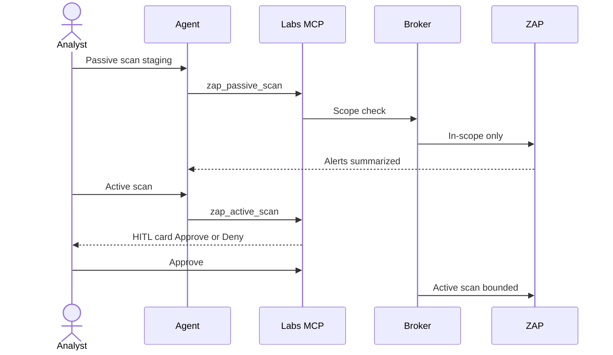

# Cloud Tools MCP design

**Status: Proposed.** SIEM MCP is **Shipped** and is the template.

Essay: [MCP as USB-C](../essays/04-mcp-usb-c-of-security-tools.md).
Shipped catalog: [agents-mcp-skills.md](../product/agents-mcp-skills.md).

## Rules

- Tools are **typed** (JSON schema), **idempotent where possible**,
  **time-bounded**.
- Names reflect **analyst verbs**: `pcap_summary`, `http_history_query`,
  `ghidra_decompile`.
- No tool named `exploit`, `shell_on_target`, or
  `dump_memory_of_host` without an engagement + HITL + scope check.
- Every call records: tenant, user, session, tool, args hash, decision
  (`allow` / `deny` / `approve`).
- Size limits on returned disassembly / HTTP bodies (summarize, don’t
  dump 2 GB into the context window).
- Prompt-injection: tool results are untrusted data; the model must not
  treat them as instructions to disable scope.

## Example verbs (illustrative — not a live API)

Labeled `example`. Not private route names.

### Packet analysis

| Tool | HITL | Notes |
|------|------|-------|
| `pcap_summary` | no | Protocol mix, talkers, duration |
| `pcap_dns_names` | no | From customer-owned capture |
| `pcap_export_http_objects` | maybe | Writes artifacts; quota |

### Web testing

| Tool | HITL | Notes |
|------|------|-------|
| `http_history_query` | no | In-scope history only |
| `zap_sitemap` | no | Allowlisted sites |
| `zap_passive_scan` | no | Still scope-bound |
| `zap_active_scan` | **yes** | Approval card in AskAkin |
| `zap_generate_report` | no | Artifact promotion |

### Reverse engineering

| Tool | HITL | Notes |
|------|------|-------|
| `ghidra_list_functions` | no | After import |
| `ghidra_decompile` | no | Size-capped |
| `ghidra_search_strings` | no | |
| `ghidra_diff_firmware` | no | Two tenant artifacts |

### Always-on meta tools

| Tool | HITL | Notes |
|------|------|-------|
| `labs_session_status` | no | Analogous to `security_engine_status` |
| `labs_scope_get` | no | What egress will allow |
| `labs_kill_switch` | **yes** | Human or admin abort |

## Auth

Session-bound, same as SIEM MCP. Inspection-only must not run as
another user. Broker injects scope; the model cannot “widen CIDRs”
via a tool argument without an admin path.

## Failure modes

| Failure | Product behavior |
|---------|------------------|
| Off-scope URL | `deny`, audit, no packet |
| Session TTL exceeded | Hibernate/destroy; tools return `session_gone` |
| Tool timeout | Partial result or error; no hang |
| Untrusted instruction in decompiler output | Treat as data |

## Relation to SIEM MCP

Same operations philosophy: REST/UI + MCP facades, audit on writes,
never fabricate results. Labs add **egress** as a first-class deny
reason SIEM did not need as much (SIEM was inbound telemetry).
