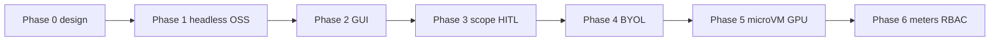

# Phased delivery

**Status: Proposed.** Dates are **phases**, never calendar promises.
Security Engine remains the existence proof for Phase 0–1 mechanics.

## Phase 0 — Design (this public repo)

RFCs, threat model, license matrix, MCP verb list, SKU sizing.
**You are reading Phase 0.**

## Phase 1 — Headless OSS

Ghidra headless + tshark + ZAP daemon behind the **existing gateway
pattern**. Chat-only UI. Single-tenant internal dogfood. No commercial
binaries. No malware zoo.

Success looks like: an analyst asks AskAkin to summarize a customer
pcap and list functions in a customer binary, with audit rows, without
a public manager-style hole.

## Phase 2 — Human GUI

Browser desktop for Ghidra / Wireshark / ZAP. Session recorder. Egress
proxy. Split view in Labs.

## Phase 3 — HITL + scope service

Asset inventory as a **first-class control-plane object**. Approval
workflow reused from agent tool-approvals. Off-scope attempts are
denies with audit, not retries.

## Phase 4 — Commercial BYOL

Burp, maybe Binary Ninja. Legal + license servers. Still no IDA
promise.

## Phase 5 — IDA / malware microVMs / GPU

Only with isolation upgrade (Firecracker-class). IDA only if Hex-Rays
terms allow. GPU as add-on.

## Phase 6 — Org sharing + RBAC + billing meters

Per-hour labs. Align with org-shared SIEM (viewer / analyst / admin).
Payments must actually exist — today they do not
([billing.md](../product/billing.md)).

## Non-goals per phase

| Phase | Will not include |
|-------|------------------|
| 1 | Public enrollment of random Internet targets |
| 2 | Shared multi-tenant desktop hosts |
| 3 | Prompt-only scope (“the model promised it’s in-scope”) |
| 4 | Bundled Burp without EULA path |
| 5 | Malware samples with open egress |
| 6 | Fake usage dashboards without metering |

## Related

[isolation.md](isolation.md) · [sku-sizing.md](sku-sizing.md)
