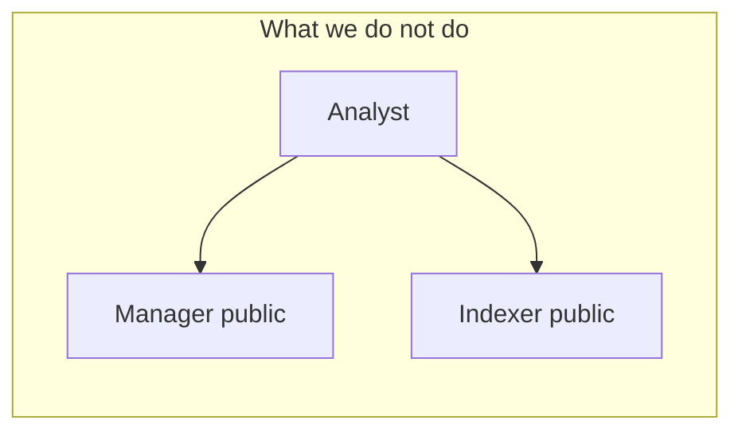
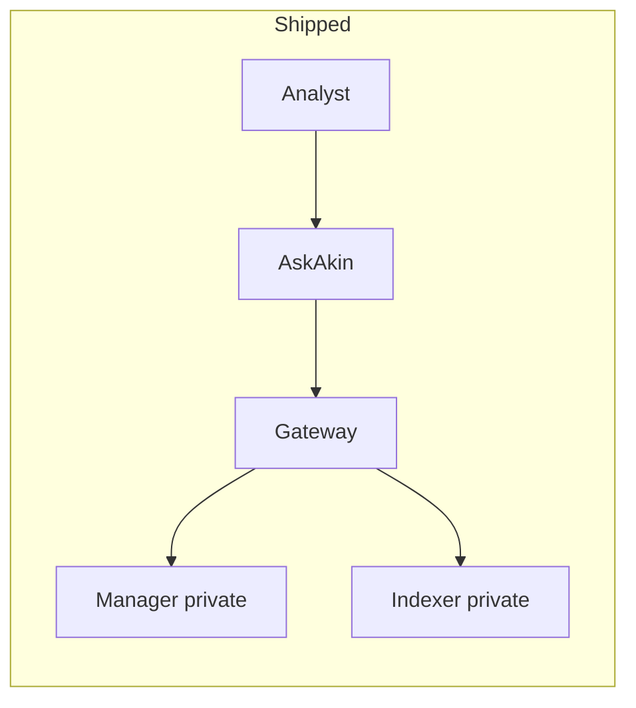

# Why a SIEM should not be on the public internet

**Status of the system described:** Shipped (Security Engine gateway).

A Wazuh manager is an operations plane for agents, rules, and active
response. An OpenSearch indexer is a search cluster that will happily
run expensive queries until the JVM sits down. Both were designed for
**private networks** with operators who already have a jump host.
Neither was designed to be a multi-tenant SaaS front door.

The tempting shortcut is: give the customer a URL, a password, maybe
IP allowlisting, and call it “cloud SIEM.” That shortcut fails in
three boring ways.

First, **identity is wrong**. Vendor UIs do not share AskAkin’s OIDC
tenant mapping, ACL on agents/skills/files, or MCP audit trail. A
second login is a second incident.

Second, **the API surface is too wide**. Manager and indexer admin
operations are useful on a lab VLAN. On the public internet they are
an enumeration gift. AkinSec’s answer is not “we hid the URL.” It is
an **allowlist gateway**: only the operations the workspace and MCP
server need, bearer-authenticated, health separated from data.

Third, **direct-from-browser** to the indexer bypasses the control
plane. Then you cannot guarantee tenant context, cannot encrypt the
token at rest in one place, and cannot prevent the model from ever
seeing it.

v1 still has a **public hostname** — the gateway. That is a smaller,
intentional aperture: TLS, bearer token, no vendor dashboard
([ADR-0017](../adr/0017-no-wazuh-dashboard.md)). Agent enrollment
ports are **not** on that aperture yet. Classic “point an endpoint at
1514” does not work in the first Railway-class topology. That is a
limitation we publish on purpose, not a mysterious outage.

Private DNS from gateway to manager and indexer keeps the data plane
off the open net. Unique hostnames per stack (company slug plus
disambiguator) avoid a single global name that becomes a cluster of
confused deputies.

Cloud Tools must copy this. A Wireshark box with a public IP and a
shared password is the same mistake with more packet captures.
[ADR-0002](../adr/0002-gateway-only-ingress.md).

The hiring-manager version: **we treated SIEM like production
infrastructure**, not like a docker-compose demo port-forwarded to
the world.
