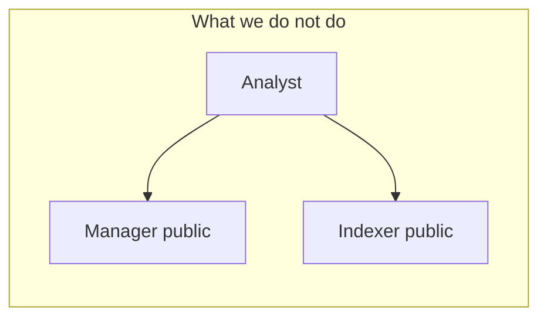
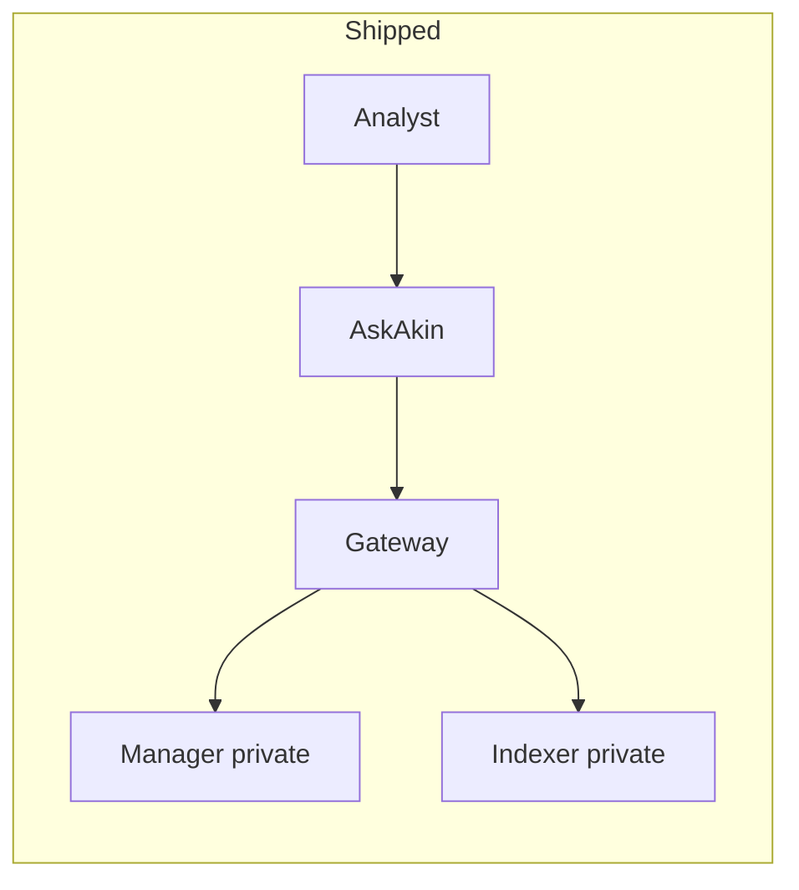

# Why a SIEM should not be on the public internet

**Status of the system described:** Shipped (Security Engine gateway).

A Wazuh manager is an operations plane for agents, rules, and active
response. An OpenSearch indexer is a search cluster that will happily
run expensive queries until the JVM sits down. Both were designed for
**private networks** with operators who already have a jump host.
Neither was designed to be a multi-tenant SaaS front door.

The tempting shortcut is: give the customer a URL, a password, maybe
IP allowlisting, and call it “cloud SIEM.” That shortcut fails in
three boring ways.

First, **identity is wrong**. Vendor UIs do not share AskAkin’s OIDC
tenant mapping, ACL on agents/skills/files, or MCP audit trail. A
second login is a second incident.

Second, **the API surface is too wide**. Manager and indexer admin
operations are useful on a lab VLAN. On the public internet they are
an enumeration gift. AkinSec’s answer is not “we hid the URL.” It is
an **allowlist gateway**: only the operations the workspace and MCP
server need, bearer-authenticated, health separated from data.

Third, **direct-from-browser** to the indexer bypasses the control
plane. Then you cannot guarantee tenant context, cannot encrypt the
token at rest in one place, and cannot prevent the model from ever
seeing it.

v1 still has a **public hostname** — the gateway. That is a smaller,
intentional aperture: TLS, bearer token, no vendor dashboard
([ADR-0017](../adr/0017-no-wazuh-dashboard.md)). Agent enrollment
ports are **not** on that aperture yet. Classic “point an endpoint at
1514” does not work in the first Railway-class topology. That is a
limitation we publish on purpose, not a mysterious outage.

Private DNS from gateway to manager and indexer keeps the data plane
off the open net. Unique hostnames per stack (company slug plus
disambiguator) avoid a single global name that becomes a cluster of
confused deputies.

Cloud Tools must copy this. A Wireshark box with a public IP and a
shared password is the same mistake with more packet captures.
[ADR-0002](../adr/0002-gateway-only-ingress.md).

## Health is not a data dump

A gateway that answers `GET /health` without a bearer token is
reasonable for a load balancer. The same URL must not return agent
inventories, index mappings, or plugin status that belongs behind
auth. Mixing those is how “just a probe” becomes OSINT on a customer
estate. AskAkin’s rule is blunt: health is liveness; data needs a
token.

## Allowlist, not a smarter reverse proxy

Transparent proxies fail closed in the wrong direction: a new vendor
path appears in an upgrade, the proxy forwards it, and suddenly
cluster settings are a browser call away. Allowlists fail closed in
the right direction: unknown paths stay unknown. That list is
**security-sensitive**; this public essay will not inventory it.
The architectural claim is enough: **named operations only**.

## Tokens

The gateway token is a stack secret. It is presented as a bearer
header, not as a query string that lands in CDN logs. The control
plane stores an encrypted copy. Chat, traces, and HITL pause payloads
are not additional copies. Rotation is an operations policy we still
owe in writing; storage hygiene is already a ship requirement.

## Enrollment is a different aperture

Classic Wazuh enrollment (manager ports for agents) is **inbound from
customer endpoints**. That is not the same problem as “analysts query
alerts.” v1 does not put enrollment on the public gateway topology.
Customers cannot yet point arbitrary endpoints at a public 1514/1515
the way an on-prem manager would. A controlled edge is **Proposed**.
Publishing the gap is better than a blog post that implies agents
“just connect.”

## What this means for Cloud Tools

Packet capture and web testing **originate outbound** connections.
The SIEM gateway mostly **pulls** from private manager/indexer. Labs
therefore need an egress allowlist in addition to an ingress broker.
The lesson still holds: do not put the raw tool on a public IP with
a password and a prayer.

The hiring-manager version: **we treated SIEM like production
infrastructure**, not like a docker-compose demo port-forwarded to
the world.
