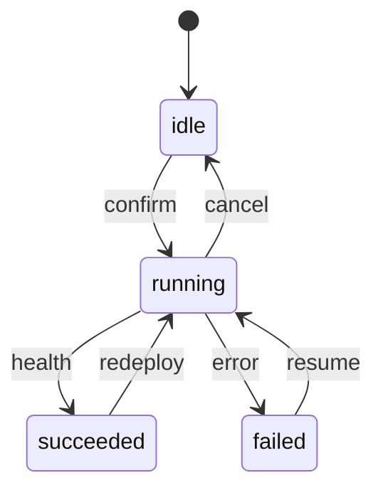

# Provisioning as a product: locks, resume, and stale cloud projects

**Status of the system described:** Shipped.

Clicking “Enable Security Engine” looks like a button. It is actually
a **distributed system**: a PaaS API, three containers, a JVM that
needs a boot window, a public hostname, encrypted metadata, and a
user who will refresh the tab.

If provision is a synchronous HTTP handler, three things happen in
the wild:

1. The request times out around thirty seconds.
2. The client retries.
3. You now pay for two indexers.

So AskAkin models provision as a **state machine** (`idle` → `running`
→ `succeeded` | `failed`) with **cancel**, and treats the cloud
project id as a durable lock object.

**Atomic lock.** Two clicks cannot create two projects. This is the
same class of bug as double-submit on a payment form, except the
payload is a SIEM.

**Resume.** If a project id already exists, **redeploy**. Do not
create. Users recover from failed deploys without orphaning spend.

**Stale running.** Processes die. A lock that stays `running` forever
is a denial of service against the customer’s own button. Re-acquire
after timeout.

**Attempt cap.** Even without Stripe, unbounded creates are an abuse
and a bankruptcy. Fresh creates are capped.

**Deleted projects.** Humans delete things in the PaaS console.
Detect that; clear stale ids; then create is allowed again.

**Dependency order.** Indexer first, boot window, then manager, then
gateway. Empty alert indices are **healthy**. Agents that invent
alerts to fill the void are the bug.

Health waits take **minutes**. The UI polls. That is not a polished
spinner over a 30s POST; it is honesty about OpenSearch security
plugins.

Human confirmation sits in front ([ADR-0010](../adr/0010-human-confirmation-before-provision.md))
because the action has **cost and security** blast radius.

## Why the indexer goes first

OpenSearch with a security plugin is the long pole. Starting manager
and gateway against an indexer that is still electing a cluster
produces false failures and panicked retries. The provisioner waits
on an indexer boot window, then brings manager, then gateway. False
failures are worse than slow successes: they burn attempt budget.

## Unique hostnames

A shared global hostname with path-based tenancy is how you get
confused deputies and cookie accidents. Each stack gets a unique
public gateway hostname derived from a company slug plus a
disambiguator. This document does not specify the DNS vendor or the
exact encoding.

## Billing later, abuse now

An entitlement hook can sit in front of create without rewriting
resume. Until a payment processor exists, **locks and attempt caps
are the billing system**. That is not cute. Unbounded JVM SIEM
projects are a real invoice.

## UX is a poller

The browser is not a bash script. Operators see `running`, can
cancel, and are told that empty indices are OK. A spinner that
assumes three seconds will lie and retrigger. Confirm-then-poll is
the product ([ADR-0010](../adr/0010-human-confirmation-before-provision.md)).

Cloud Tools will fail the same way if “Start Ghidra” is a fire-and-
forget docker run. Copy resume or copy the incident.

[provisioning.md](../architecture/provisioning.md) ·
[ADR-0007](../adr/0007-async-provision-resume.md)
