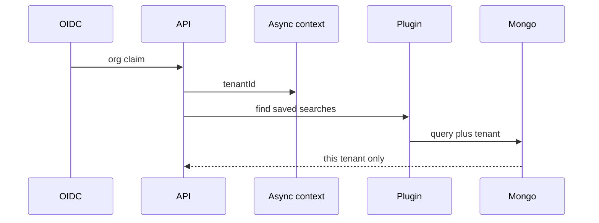

# Multi-tenant MongoDB without hoping the query author remembered tenantId

**Status of the system described:** Shipped.

AskAkin’s control plane is document-shaped: users, conversations,
agents, skills, files, saved SIEM searches, interpreter records, audit
events. A security product that stores those in a shared cluster and
filters “in the controller if we remember” will leak. Not maybe.
Eventually.

The standard failure is a new list endpoint. It works in the demo
tenant. It ships. It forgets `tenantId`. Another customer’s saved
search titles appear. That is game over for a SIEM company — even if
the documents were “only” chat titles.

AkinSec’s answer: a **Mongoose plugin plus async context**.

- Incoming request (OIDC) establishes tenant.
- Async context carries `tenantId` into the data layer.
- Queries are scoped automatically.
- Cross-tenant **mutations are rejected**, not silently coerced.

Handlers can still be wrong. They are not the last line. Background
jobs and MCP tools must **propagate the same context**. An
“inspection” MCP that runs as a support user against another tenant is
a confused deputy, not a feature.

Caches and logs need the same discipline. A global LRU of “last alert
query” is a cross-tenant oracle.

v1 SIEM stacks are still **per user** while the document store is
**per tenant**. That mismatch is documented ([ADR-0012](../adr/0012-interpreter-org-siem-user.md))
so we do not pretend RBAC exists for engines yet.

This is unglamorous work. It is also the difference between a demo and
something you can put in a vendor questionnaire without lying.

[data-isolation.md](../architecture/data-isolation.md) ·
[ADR-0006](../adr/0006-tenant-isolation-data-layer.md)
