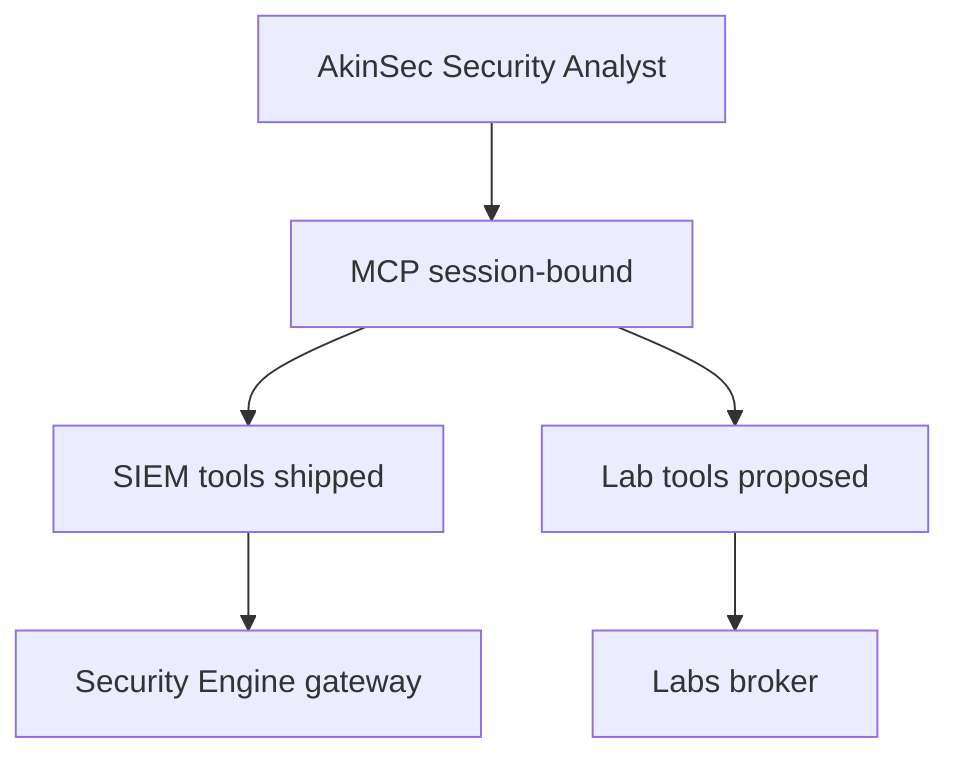

# MCP as the USB-C of security tools

**Status:** SIEM MCP **Shipped**. Cloud Tools adapters **Proposed**.

USB-C is not interesting because it is a connector. It is interesting
because the same cable shape carries power, video, and data — and the
device still decides what is allowed. MCP is that shape for models:
**typed tools**, not “here is a shell.”

AskAkin already needed a way for a Security Analyst agent to ask
“are you healthy?” and “what are the critical alerts?” without
inventing a second agent framework. MCP was in the LibreChat chassis.
AkinSec added a **product server** bound to the signed-in user:
status, agents, alerts, threats, saved searches, and two audited
writes.

The USB-C claim is the **roadmap**: Ghidra, tshark, and ZAP should
not get a one-off “function calling JSON” each. They get adapters
with the same rules — schema, timeout, audit, HITL flag, session
binding.

What USB-C is not: a promise that every dongle is safe. We do not
expose `exploit` as a verb. We do not let the model widen scope. We
do not dump 2 GB of disassembly into the context window.

REST remains the first-party UI facade ([ADR-0008](../adr/0008-mcp-and-rest-facades.md)).
Two facades, one operations layer, so Discover filters and agent
filters cannot drift.

If Cloud Tools ships as “paste this screenshot into chat,” we will
have wasted the only interface standard that lets the same agent
operate SIEM on Tuesday and a customer binary on Wednesday.

[agents-mcp-skills.md](../product/agents-mcp-skills.md) ·
[mcp-design.md](../cloud-tools/mcp-design.md)
