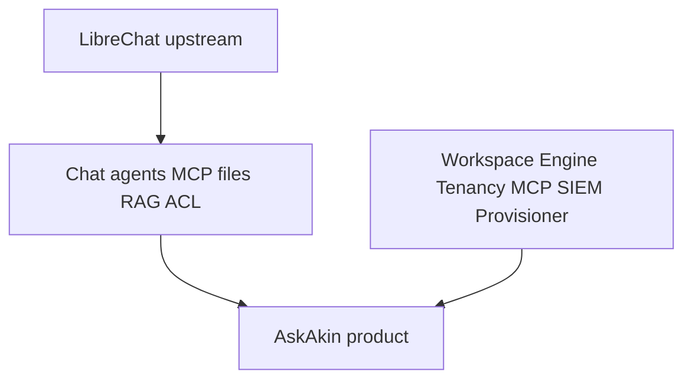

# LibreChat is a chassis, not the car

**Status of the practice described:** Shipped.

LibreChat is a strong open-source conversational platform: multi-provider
routing, agents, MCP client behavior, artifacts, files, RAG wiring, a
mature React SPA, and an ACL lineage that already thinks about sharing.
AkinSec did not beat that by rewriting chat in a weekend.

The mistake would be to **become** LibreChat. Customers would log into
someone else’s brand. Upstream i18n automation and community CI would
fight security-workspace chrome. Hiring managers would see a theme
toggle.

So AskAkin treats LibreChat as a **chassis**:

- Keep the engine that already streams tokens and hosts agents.
- Bolt on a security body: eight workspace tabs, Security Engine,
  WorkOS tenant mapping, AkinSec MCP SIEM server, provisioners.
- At merge time, **preserve** AkinSec surfaces (on the order of ~120
  paths in the private tree — not listed here).
- **Selectively port** CVEs, authz, MCP, billing idempotency. Skip
  Locize/community branding CI.

Lineage is v0.8.6-era; an in-tree version reported as v0.8.7 during a
2026 sync. Public `dfalt0/LibreChat-akinsec` tracks **upstream shape**.
It is not the private overlay. If you clone it, you do not have AskAkin.

Credits stay loud. This repo will not copy librechat.ai. We write
**deltas**. Locales: 40+ folders exist; many are upstream; we do not
claim unique translation of all of them.

Helm for the chat API is chassis. Per-project PaaS for SIEM is the car’s
drivetrain. Do not say Kubernetes is how production engines are
provisioned today.

[ADR-0001](../adr/0001-librechat-as-upstream.md) ·
[ADR-0018](../adr/0018-selective-upstream-sync.md) ·
[upstream-librechat.md](../architecture/upstream-librechat.md)
