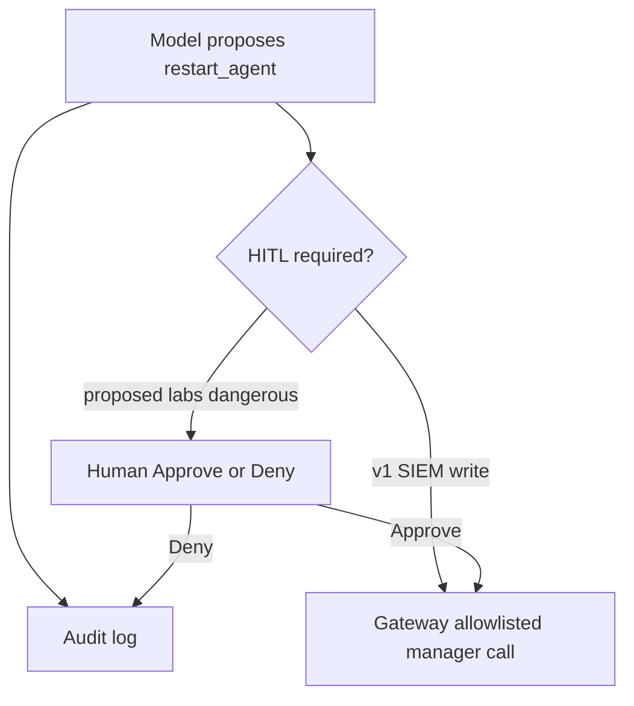

# Human-in-the-loop for models that can restart production agents

**Status:** audited single-target writes **Shipped**. Approval cards
for every write **Proposed**. Cloud Tools HITL **Proposed**.

Once an agent can call `restart_agent`, you have left the chat demo
and entered change management. Endpoint agents are production. A
wrong restart during an incident is an outage with extra steps.

v1’s answer is deliberately small:

- **One** target, not a fleet.
- **Audit** every call (tenant, user, tool, args hash).
- **No** bulk restart, rule upload, or active-response fire-and-forget
  from the model ([ADR-0009](../adr/0009-audited-single-target-writes.md)).

That is not the same as a human clicking Approve. Honest: a compromised
or confused model can still restart **one** device the user is allowed
to see. The next tightening is HITL cards — especially before Cloud
Tools active scans, which outbound-connect.

Principles that do not wait for the card UI:

- Never invent that a restart succeeded.
- Never run MCP as another user.
- Never put gateway tokens in the pause payload.
- Explain the blast radius in the thread (“this one agent, this id”).

SOAR playbooks with HITL are **Proposed**. Autonomous “just remediate
production” is not a roadmap item; it is a non-goal
([ADR-0016](../adr/0016-ai-copilot-hitl.md)).

The resume translation: **tools with side effects got the same
skepticism as production CD**, not a chatbot plugin.
