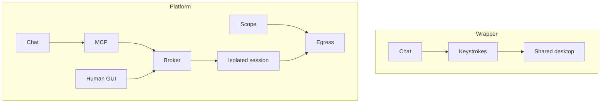

# Hosting Wireshark and Ghidra next to a chatbot is an isolation problem, not a wrapper problem

**Status: Proposed** (labs). The **pattern** is proven by Security Engine.

The wrapper instinct: iframe a desktop, let the LLM send keystrokes,
call it “AI-native Burp.” That product dies in two ways. Either the
desktop is **shared** and files leak across tenants, or it is **public**
and you have reinvented an unauthenticated jump box.

AkinSec already rejected that instinct for SIEM. Manager and indexer
are private; a gateway is the aperture; tokens are per stack and
encrypted at rest. Cloud Tools that ignore this would be a regression.

Isolation is the product:

| Layer | SIEM (shipped) | Labs (proposed) |
|-------|----------------|-----------------|
| Unit | Cloud project per user | Session environment per tenant session |
| Ingress | Allowlist gateway | Broker + optional desktop on **same session id** |
| Egress | Mostly inbound telemetry | **Default deny**, scope allowlist |
| Secrets | Stack secrets on project | License keys BYOL on session; still not in chat |
| Hostile input | Alerts are untrusted text | Binaries and pcaps are untrusted **code and captures** |

Malware and untrusted firmware are not “Ghidra with more RAM.” They
are a **microVM** problem: snapshot, no unrestricted internet, shred
volumes. nsjail in the code interpreter is the wrong boundary.

Alpha can still use the **same PaaS** as Security Engine for ZAP,
tshark, and Ghidra headless. That reuses locks, hostnames, and
health waits. It is not good enough for malware. The RFC says that
out loud so sales cannot skip Phase 5.

## Hostile input is the point of RE labs

SIEM alerts are untrusted **text**. Firmware and malware are untrusted
**programs**. A wrapper that mounts a customer binary into a shared
host filesystem is a supply-chain attack on AkinSec itself. Read-only
mounts, encrypted volumes, shred-on-destroy, and no unrestricted
egress are not “compliance theater.” They are how you survive the
first sample that looks like a PDF.

## Same session id

If the human desktop and the MCP adapter are two environments, the
agent will describe a binary the human cannot see. Broker and GUI
must share a session id. That is also how audit correlates “approved
active scan” with packets that actually left.

GPU, Kasm/Guacamole, Firecracker, customer VPC — those are isolation
**upgrades**, not decorations. If we cannot name the tenant boundary
on a whiteboard, we do not host the tool.

[isolation.md](../cloud-tools/isolation.md) ·
[ADR-0013](../adr/0013-cloud-tools-same-pattern.md)
