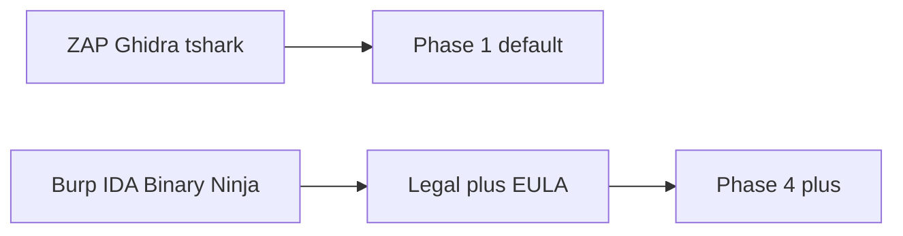

# BYOL or bust: Burp and IDA in a SaaS world

**Status: Proposed.** Neither commercial tool is hosted today.

Hiring managers will ask whether AkinSec “includes Burp and IDA.”
The career-ending answers are “yes” (if untrue) and “we’ll just run
the trial key in Docker” (if true).

Commercial reverse-engineering and web-testing ISVs did not write
EULAs so a startup could become an unlicensed service bureau. PortSwigger
and Hex-Rays can end a product with a letter. Apache-licensed ZAP and
Ghidra exist specifically so an honest company can ship a default
without that letter.

**BYOL** means: the customer already paid the ISV; they bring the
license; AkinSec provides **isolated runtime**, broker, MCP (if the
licensed API allows), audit, and scope. Until counsel and the vendor
agree, the UI should not have a “Start IDA” button.

GPL Wireshark is a different honesty: if we modify and distribute, we
owe corresponding source — or we run unmodified packages and say so.

This repo will not contain cracks, keygens, or “educational” binaries.
The RFC is the policy: **OSS-first defaults, commercial as BYOL,
never pirate**.

[licensing.md](../cloud-tools/licensing.md) ·
[ADR-0015](../adr/0015-byol-oss-first.md)
