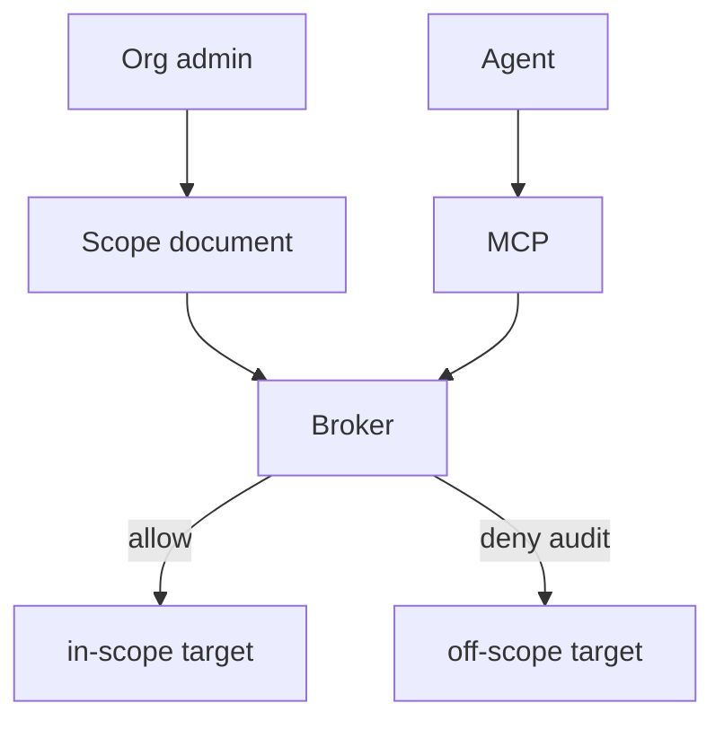

# Authorized scope as a control plane object

**Status: Proposed** as a first-class service. v1 SIEM is scoped by
**which engine you own**, which is weaker than a CIDR inventory but
is still not “the prompt said it was fine.”

Offensive-capable tools make HTTP requests and parse binaries. If
scope lives only in system prompt text, prompt injection **is** the
admin API.

Scope must be a **document** the broker enforces:

- Domains, CIDRs, artifact ids, staging URLs the org admin declared
- Injected into egress allowlists
- Visible to the analyst (`labs_scope_get`)
- Changeable only through an admin path, not `tool_call(widen=true)`

SIEM today: you cannot search another user’s indexer because you do
not have their gateway token. Labs tomorrow: you cannot scan another
company’s website because the **proxy will not connect**. Same idea,
more outbound.

Continuous red team, if ever sold, is a **mode** with contracts —
still bound to the same object, never unsolicited third parties.

[ADR-0014](../adr/0014-authorized-scope-binding.md) ·
[authorized-use.md](../security/authorized-use.md)
