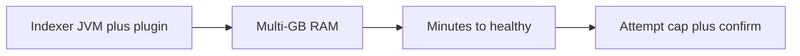

# Cost of a per-customer JVM SIEM

**Status:** lesson from **Shipped** Security Engine. Numbers in SKU
tables are **design estimates**, not invoices.

OpenSearch with a security plugin does not run in 256 MB. AkinSec
learned this the noisy way: indexer boot windows, health waits measured
in minutes, three containers per principal. That cost is why provision
has **attempt caps** and **resume** instead of create-always.

The same lesson applies to labs. Ghidra decompilation and Wireshark
pcap storage are not “chat tokens.” Undersizing VMs produces OOM
kills that look like product bugs. Oversharing VMs produces isolation
bugs that look like breaches.

v1 is **per user**, which multiplies spend inside one company. Org-shared
engines are proposed partly for **security RBAC** and partly because
paying for N indexers per N analysts is a bad SKU.

Cloud Tools SKUs start from that memory honesty: 16 GB-class Ghidra,
disk-heavy Wireshark, sleep-on-idle. GPU is an add-on. Payments are
not live, so dogfood still needs caps.

[sku-sizing.md](../cloud-tools/sku-sizing.md) ·
[cost-model.md](../operations/cost-model.md)
