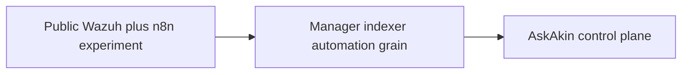

# From n8n+Wazuh experiments to a full control plane

**Status:** historical. Public repo
[dfalt0/wazuh-n8n](https://github.com/dfalt0/wazuh-n8n) shows SIEM
automation interest. It is **not** AskAkin and not a put-down of n8n.

n8n is a reasonable way to wire “alert → ticket.” A founder can learn
Wazuh’s grain: agents, rules, indexer documents, the difference between
a dashboard and an API. That experiment belongs on a public GitHub
as **lineage**, the same way LibreChat is chassis lineage.

It does not give you:

- OIDC organization → tenant
- Per-customer isolated stacks
- An allowlist gateway
- Encrypted gateway tokens
- MCP tools that refuse to invent CVEs
- A workspace that is the UI instead of Kibana

AskAkin is that control plane. The public n8n work is a rung on the
ladder, not the product. We link it so a hiring manager can see
**continuity** (Wazuh, automation, SIEM) without confusing a workflow
tool for multi-tenant SaaS.

Do not treat `wazuh-n8n` as a current integration in production AskAkin.
Do not copy compose secrets from any public fork into this repo.

[NOTICE.md](../../NOTICE.md)
