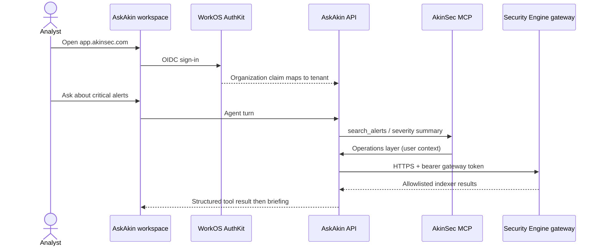

# AskAkin

**Status: Shipped** (Security Engine **v1** limits are on the engine
page). Cloud Tools workstations are **Proposed** and are not described
as live SKUs here.

AskAkin is AkinSec’s security workspace: a multi-tenant web application
where analysts chat with models, run agents and skills, and operate a
live SIEM through the same chrome.

Production: [https://app.akinsec.com](https://app.akinsec.com).
Do not treat this document as a deployment guide.

## What shipped

- Multi-provider AI chat (OpenAI-compatible, OpenRouter, Anthropic,
  Google, Azure, Bedrock, and other LibreChat-lineage providers).
  Customers may bring their own provider credentials. Those credentials
  are stored **encrypted**. Missing encryption configuration **fails
  closed** (no plaintext fallback).
- Agents, skills, MCP servers, artifacts, prompts, file upload.
- RAG via an embedding API and pgvector.
- Conversation search via Meilisearch.
- Security workspace chrome — eight tabs. See [workspace.md](workspace.md).
- Security Engine onboarding and per-user stack provisioning.
  See [security-engine.md](security-engine.md).
- AkinSec MCP server (streamable HTTP) bound to the signed-in user.
  See [agents-mcp-skills.md](agents-mcp-skills.md).
- Org-scoped code interpreter. See [code-interpreter.md](code-interpreter.md).
- WorkOS/OIDC login and tenant isolation.
  See [identity-tenancy.md](identity-tenancy.md).

## What AskAkin is not

- Not a consumer chatbot that ships investigation threads to a random
  hosted model with no policy.
- Not a reskin of LibreChat. LibreChat is an upstream patch source.
  See [upstream-librechat.md](../architecture/upstream-librechat.md).
- Not a certified GRC product. Ops framework cards are posture rollups
  when SCA data exists; otherwise an **empty state** or non-live sample
  presentation when the engine is not provisioned.
- Not an open-source application. Source is private.

## How a session fits together

## Runtime shape (conceptual)

A full development-shaped layout includes the control-plane stores
(MongoDB, Meilisearch, pgvector, RAG API) plus optional data-plane
pieces (Wazuh manager/indexer, code interpreter). Kubernetes Helm
lineage exists for the **chat API**. Production SIEM provisioning today
is **per-project cloud PaaS**, not “everything already runs on the Helm
chart.” See [containers.md](../architecture/containers.md).

## Localization

A large English string catalog exists. Many additional locale files
exist in the product; a substantial portion is **upstream**. Do not
claim AkinSec uniquely translated every locale.

## Related

- [Security Engine](security-engine.md)
- [Cloud Tools RFC](../cloud-tools/README.md) (**Proposed**)
- [FAQ](../faq.md)
