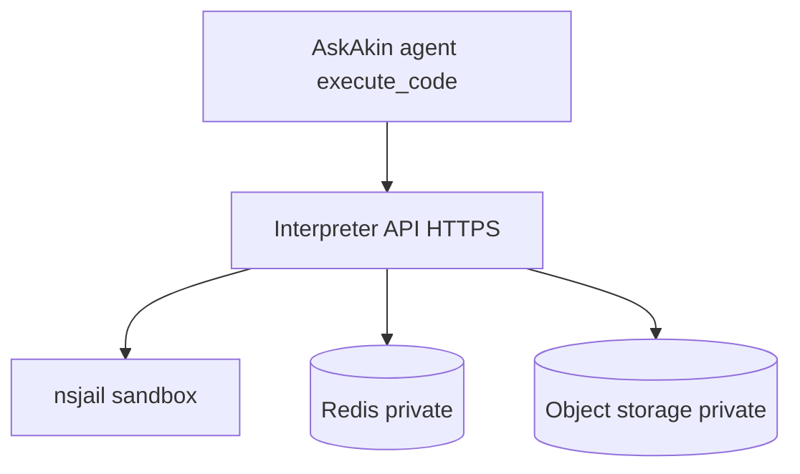

# Code interpreter

**Status: Shipped** (org-scoped). Isolation strength depends on whether
the PaaS allows privileged containers.

The interpreter is **separate from Security Engine**. An org admin
provisions a dedicated cloud project:

| Container | Network posture |
|-----------|-----------------|
| Interpreter API | Public HTTPS |
| Redis | Private |
| Object storage (Garage-like) | Private |

Execution runs in **nsjail inside the API process**, not one Docker VM
per user. The host requires elevated Linux capabilities (`SYS_ADMIN`,
optionally `NET_ADMIN`). Agent `execute_code` / bash-style tools use
this stack.

## Fallback (honest tradeoff)

If the PaaS refuses privileged containers, a **shared interpreter with
per-org API keys** is a weaker fallback. That is **not the goal**. It is
documented so operators do not confuse “keys in headers” with
hardware-level isolation.

## Residual risk

Sandbox escape is a real class of bugs. Org isolation and nsjail reduce
blast radius; they do not make escape impossible. See the
[threat model](../security/threat-model.md) and
[ADR-0012](../adr/0012-interpreter-org-siem-user.md).

## Relation to Cloud Tools

Cloud Tools (**Proposed**) is **not** “put Ghidra in the code
interpreter.” Malware and untrusted binaries need a different isolation
tier (microVMs). The interpreter proves the platform can provision
**org-scoped** side stacks with private data stores. Labs reuse that
operational muscle, not the nsjail process model.
[isolation.md](../cloud-tools/isolation.md).
