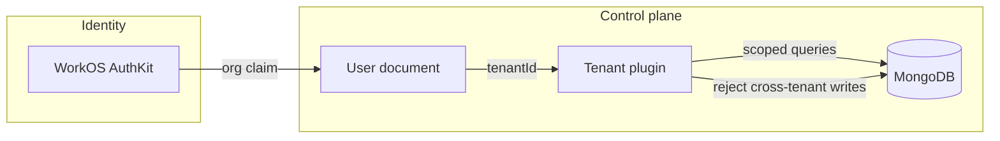

# Identity and tenancy

**Status: Shipped** for OIDC-first production identity and data-layer
tenant isolation. Security Engine **sharing** is still per-user (**Partial**
relative to the org model).

## Production identity (shipped)

AskAkin production login uses **WorkOS AuthKit** as an **OIDC Connect
Application** (confidential client) against [app.akinsec.com](https://app.akinsec.com).
This document does **not** list callback URLs, client IDs, or issuer
hostnames beyond that public domain.

Public talking points:

- WorkOS Connect Application (OIDC) is used for login — not a generic
  API key mistaken for OIDC.
- Social login (for example Google) can be via AuthKit.
- Optional native Google OAuth on the login form is a **separate** path;
  production prefers AuthKit.
- Email/password can exist in the LibreChat lineage; AkinSec production
  is **OIDC-first**.
- 2FA exists in the lineage.
- Role/ACL for agents, skills, prompts, files, and shares is inherited
  and extended from that lineage, then **partitioned by tenant**.

[ADR-0005](../adr/0005-oidc-workos-tenant-mapping.md)

## Organization → tenant (shipped)

```text
User signs in with WorkOS AuthKit (OIDC, confidential client).
Org claim (organization id) maps to tenantId on the user document.
Mongo plugin injects tenantId into queries; rejects cross-tenant mutations.
Caches and logs are tenant-aware.
Code interpreter stacks are keyed by tenant (org), not by every user.
Security Engine v1 is keyed per user (honest limitation).
```



## Data-layer isolation (shipped)

Tenant isolation is **not** “the route handler remembered to add a
filter.” A Mongoose plugin plus async context injects `tenantId` into
queries and **rejects cross-tenant mutations**. Essay:
[Multi-tenant MongoDB without hoping the author remembered tenantId](../essays/03-multitenant-mongodb.md).
[ADR-0006](../adr/0006-tenant-isolation-data-layer.md).

## Bring-your-own model credentials (shipped)

Customer LLM provider credentials are stored **encrypted**. If
encryption configuration is missing, the path **fails closed**.
Credentials must not appear in HITL pause payloads (design rule).
See [secrets-model.md](../architecture/secrets-model.md).

## v1 split: interpreter vs SIEM keys

| Resource | Keyed by (v1) | Intent |
|----------|----------------|--------|
| Code interpreter | Organization / tenant | Shared sandboxes per org |
| Security Engine | User | One stack per principal |

Unifying SIEM to **per-tenant** with viewer / analyst / admin RBAC is
**Proposed**. [ADR-0012](../adr/0012-interpreter-org-siem-user.md).

## Inspection-only MCP

Session-bound MCP cannot be “inspected as another user.” Confused-deputy
risk is called out in the [threat model](../security/threat-model.md).
